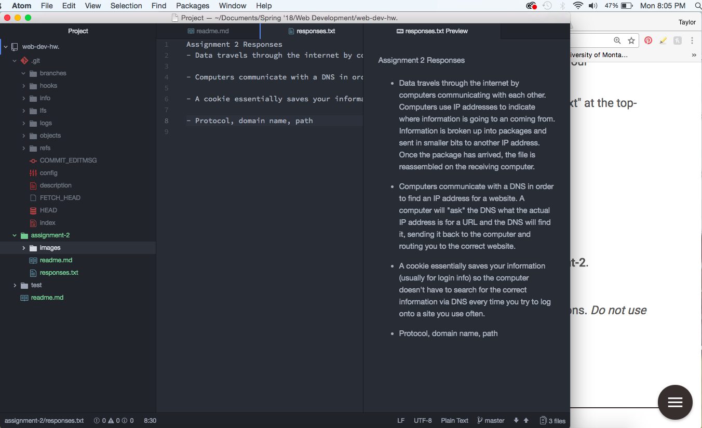

# Assignment 2

A version control system lets someone track changes they make on a project or file, and allows them to go back and see the entire history of a project. We are using a version control system (GitHub) so that we can track our changes throughout the class and easily go back into our old assignments. GitHub is also a commonly used system and understanding it will give us a leg up if we become collaborators in the future.

[Assignment 2 responses](./responses.txt)

## Work Cycle
For this assignment I worked closely with the examples on the course website in order to ensure that I was doing everything correctly. I tried to use markdown effeciently in files like my respones.txt becauase having headings makes me feel more organized. Last week I tried to help one of my classmates access the Markdown Preview tool using keyboard shortcuts.

