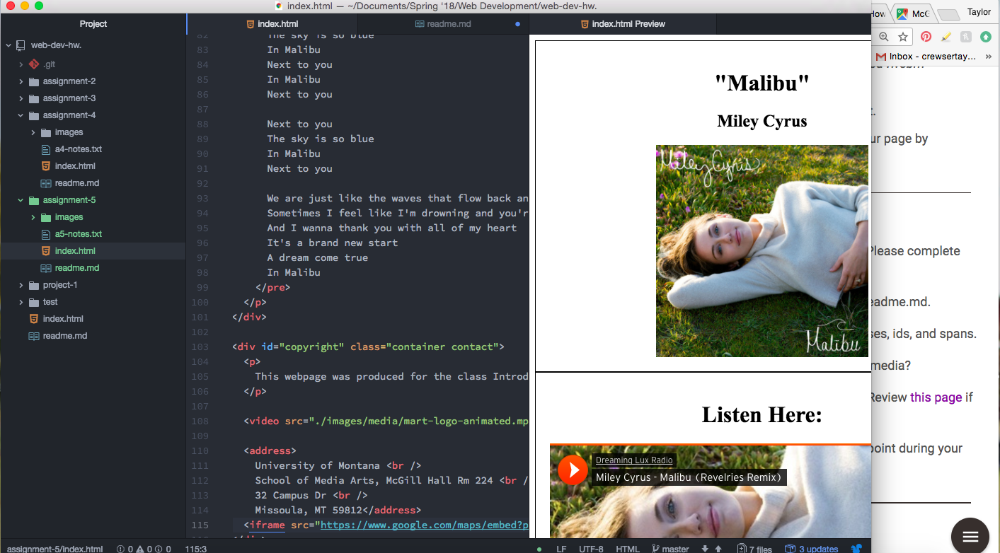

# Assignment-5 Readme

- Divs divide different sections of your webpage for organization and clarity. The Class attribute organizes similar elements on the webpage into groups, which allows you to style them together. The Id atttribute identifies individual elements on the webpage. The Span element lets you differentiate elements through style within a 
 element.

- Third-party media is pre-formatted in a way that will generally work for your webpage, without making you do all the work!

## Work Cycle

This assignment went by a little quicker than the others, but I continued my strategy of working with Atom open next to the instruction page.

Something that I struggled with this week was remembering how to correctly format elements that we learned in the first week of class. I had to go back into the previous modules to remember whether some of the elements were closed or open, had source elements, and so on.

One thing I really liked about this week was that we had to build the site from scratch ourselves. I like seeing everything come together with content that I picked out myself! 

