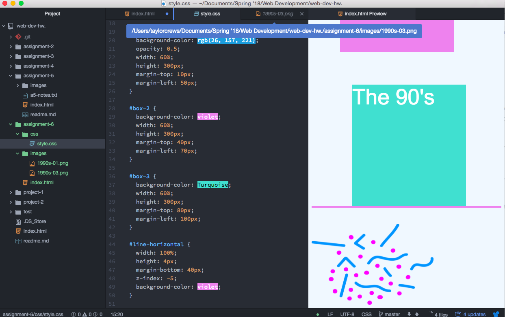

# Assignment-6 Readme

- For this assignment I decided to go with the 90's era, because I really like the bright colors associated with that time. I chose a graphic with simple dots and lines, and tried to keep my page design simple as well.

- For my color palette, I chose: voilet, Turquoise, and rgb(26, 157, 221), because I liked that some of the colors were also in the graphic, while others were geared toward the time period. 

## Work Cycle

This assignment was definitely the biggest challenge for me so far.

For some reason, I didn't link my css page to my index.html correctly at first, so the changes I was making on my stylesheet weren't translating onto my site, making it difficult to see what was happening.

I ended up looking at the code on a few of my classmates assignments, and once I got my stylesheet to link correctly, everything went smoothly!

