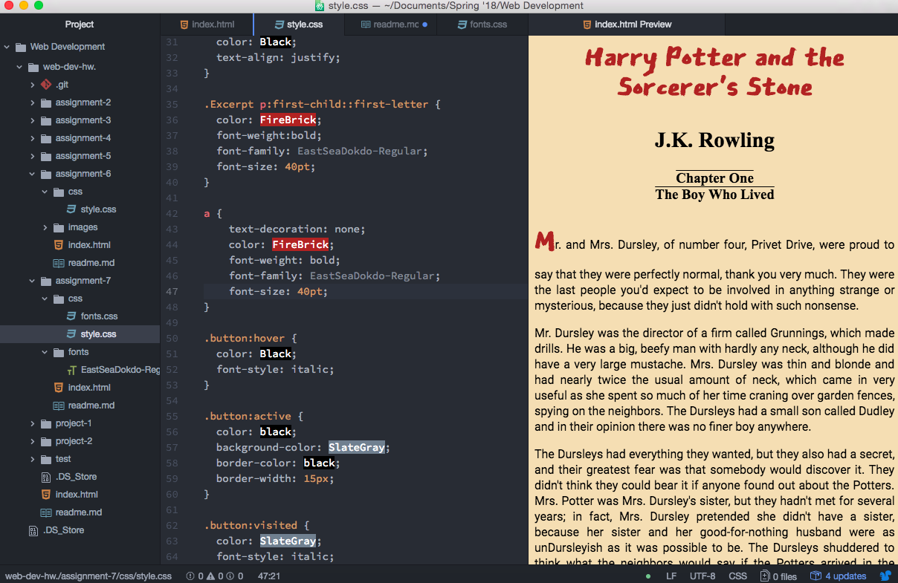

# Assignment-7 Readme

- For this assignment I decided to go with a red color scheme, to represent the Sorcerer's Stone. I used a handwritten font (EastSeaDokdo) to reflect the setting of Hogwarts and Harry Potter. And a simple sans serif font for the paragraphs (Roboto).

- A system font is a font that automatically comes with a certain software type. A web font is a font that is hosted on a server and has to be placed into an element to appear on a page. A web-safe font is a font that will be available to the system and viewable on webpages.

## Work Cycle

For this work cycle I was really excited to develop a palette and font family for The Sorcerer's Stone because I am a big Harry Potter fan.

I found this assignemnt enjoyably challenging to work on. At one point I was having a lot of trouble getting my fonts to register on my index.html and doublechecked every aspect of my code until I realized that I had typed "font" instead of "fonts" when trying to link to my .ttf file - it's the little things! 

