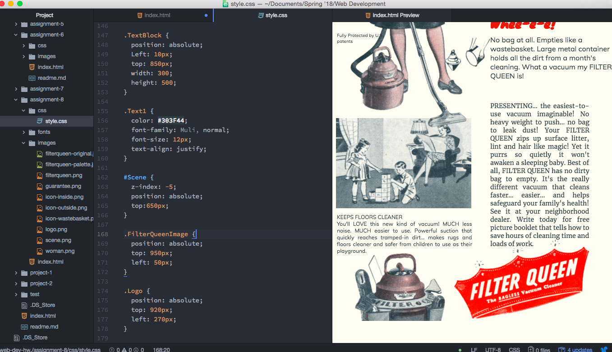

# Assignment-8 Readme

- Padding is the amount of space between the objects inside of a box and the borders of the box. Margins are the amount of space between the box and elements surrounding the box. Bordes are the sides of the boxes, and you can edit the thickness, color and style of them.

- The hardest part of this assignment was figuring out the positioning of elements. I started by using relative positioning, and then ended up converting all of my elements to absolut positioning, which was a big mess!

## Work Cycle

I thought this was a great and challening assignment to end the semester on!

Althought I had some hiccups along the way, namely with figuring out the positioning, I think it turned out really well!

