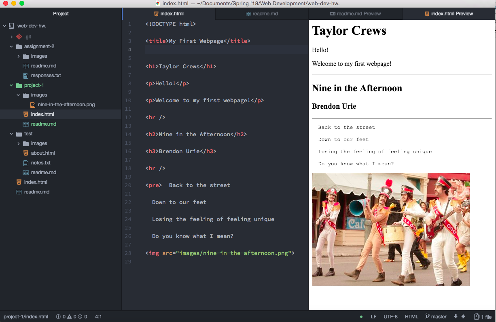

# Project 1 Readme
## Taylor Crews
1. I typically use Google Chrome on my laptop and on my phone. I store a lot of my school work on my Google Drive, so it's much easier to access my Google Suite from Chrome. Browsers are the tools we use to view webpages, they translate programming language and retreive information from servers that becomes visible to us on a webpage.

2. When I used the Wayback Machine I decided to take a deeper look at UM's site throughout the years. I thought it was interesting because UM has recently talked about the need for a consistent rebrand, and even from 2002 to 2007, it's difficult to determine the "brand" UM is trying to portray.

### Project 1 Workcycle:

For this project I tried to follow instructions exactly, and made sure to go back and fix something that wasn't right before continuing. One problem that I faced toward the beginning was remembering to put opening and closing tabs on my elements, it definitely took a little bit of time to get into the habit of that. I'm excited to get into CSS and to learn more about stylizing webpages! 

