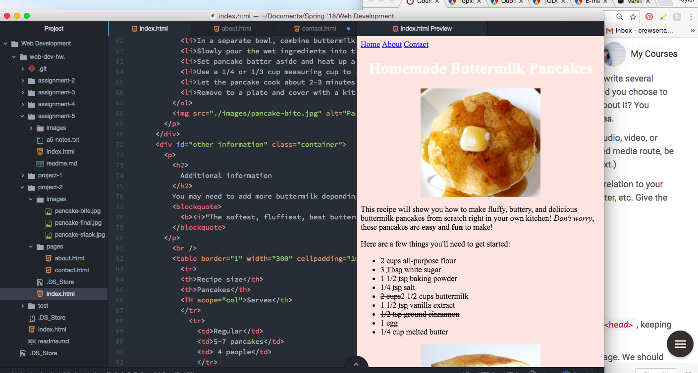

# Project-2 Readme

- Learning HTML was a challenge at first- There are so many different elements and at times I wonder if I will ever be able to code anything without constantly looking at another screen or my book for reference. With that being said, I have already used my limited knowledge of HTML for several projects outside of this, and when I'm trying to understand how a website works, or why something is doing what it's doing, I can now open up the page's source and get a better idea of what's going on.

- I'm really excited to get into CSS! I've been working on a website for my uncle using Google Sites (which doesn't let you code within the site, you have to embed everything), and while I've been able to do some things with it, there are a lot of ideas that require CSS to execute, and I think that will make my sites more unique overall.

## Work Cycle

This assignment was what I've been hoping to be able to do with the knowledge we've learned in class so far-create my own site from scratch.

This project wasn't easy, and I definitely found myself losing steam while working on the final pages. I got a little bit of a late start on the project, but honestly didn't run into any big problems or hiccups while building!

